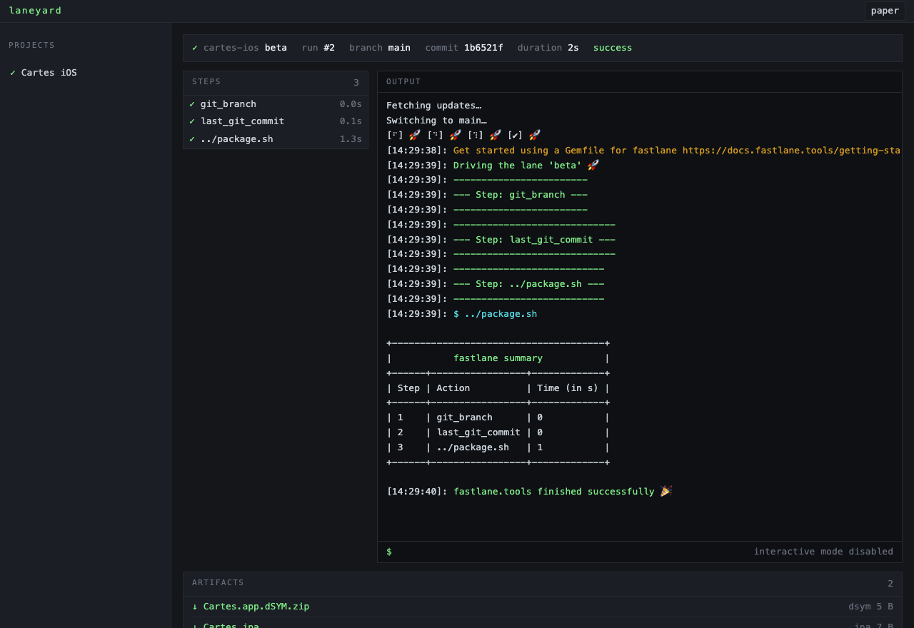
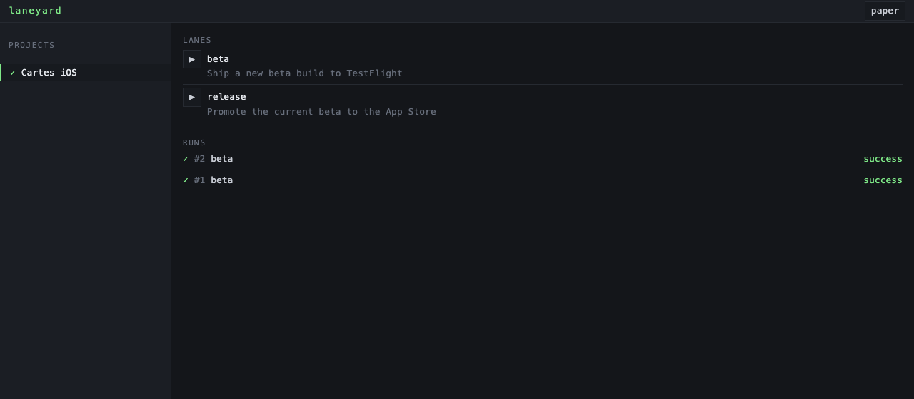

# Laneyard

**A self-hosted web UI for fastlane.**

Laneyard is a browser interface for the fastlane lanes you already have, running on hardware you
own. Pick a lane, click run, watch the output stream, download the artifact. Nobody else holds
your signing keys, and nobody meters your minutes.

It replaces neither fastlane nor your Fastfile — it drives them. Your lanes stay exactly where
they are.



## Why

**You keep the keys.** Certificates, provisioning profiles, keystores and App Store Connect
credentials stay on your machine. A hosted CI is a third party holding everything needed to ship
as you.

**Minutes stop existing.** A Mac mini costs less than a year of most CI plans and does not bill
by the second. Long builds stop being a budget decision.

**It is just fastlane.** No new DSL, no YAML dialect, no vendor config to port. Laneyard reads
the Fastfile you already have and asks *your* fastlane what it can do — plugins included. It
hard-codes no knowledge of fastlane at all, so upgrading fastlane or adding a plugin needs no
change here.

## Where it fits

|                              | Laneyard    | Hosted CI    | Self-hosted runner |
| ---------------------------- | ----------- | ------------ | ------------------ |
| who holds your signing keys  | you         | the vendor   | you                |
| cost per build               | electricity | per minute   | electricity        |
| setup                        | one command | a signup form| a weekend          |
| works offline                | yes         | no           | yes                |
| build queue across a team    | planned     | yes          | yes                |
| runs on pull requests        | planned     | yes          | yes                |

If your team needs parallel builds across a fleet today, use something else and come back later.
Laneyard is for one machine you control.

## Requirements

- **Node 22 or newer** — the server.
- **Ruby with fastlane**, either through a project `Gemfile` (recommended) or installed for the
  active Ruby. Laneyard never bundles its own fastlane; it uses your project's.
- **git**.
- macOS or Linux. An Android project has no business needing a Mac.

## Install

```bash
npm install -g laneyard
```

Then, from a project you already build with fastlane:

```bash
cd ~/code/your-app
laneyard add     # adopt this project
laneyard         # start the server
```

`laneyard add` inspects what is there — the `fastlane` directory even when nested in a monorepo, a
`Gemfile`, an Xcode project or a Gradle build — writes the matching block into
`~/.laneyard/config.yml`, and prints a generated server password once. Write it down; it is not
shown again.

<details>
<summary>Running from source instead</summary>

```bash
git clone https://github.com/martinfrouin/laneyard.git
cd laneyard
npm install      # builds on install
npm link         # puts `laneyard` on your PATH
```

</details>

Open it from any machine on your network, sign in, and your lanes are listed — because Laneyard
asked your project's own fastlane for them.



## Configuration

All configuration lives in files. The database holds execution state only, so backing up
Laneyard means copying one file, and restoring it means copying it back.

### `~/.laneyard/config.yml` — the server and its projects

```yaml
server:
  port: 7890
  bind: 0.0.0.0
  password_hash: "scrypt$…"      # written by `laneyard add`
  max_concurrent_runs: 1
  retention: { runs: 50, artifact_days: 30 }

projects:
  - slug: cartes-ios
    name: Cartes iOS
    git_url: git@github.com:you/cartes.git
    default_branch: main
    git_auth: { kind: ssh_key, ref: ~/.ssh/id_ed25519 }
```

### `laneyard.yml` — optional, committed in your repository

Build behaviour belongs next to the code, so it can be versioned with it:

```yaml
fastlane_dir: fastlane
runtime: bundle                  # or `system`
timeout_minutes: 60
artifact_globs:
  - "build/**/*.ipa"
  - "build/**/*.app.dSYM.zip"
```

Field by field, the repository file wins over the server block, which wins over the defaults. Any
field of `laneyard.yml` may also be written in the server block, so a repository you would rather
not touch can be configured entirely from `config.yml`.

Both files are watched: edit them by hand and Laneyard picks the change up. An invalid file is
reported and the last valid configuration stays live — a typo never takes the server down.

## Security

Read this before putting Laneyard on a network.

- **It is built for a local network, not the internet.** It listens on `0.0.0.0` so you can reach
  it from your laptop, behind one password. Do not expose it publicly. If you need remote access,
  put it behind a VPN or an SSH tunnel.
- **The password** is stored as an scrypt hash and repeated failures are throttled. Sessions live
  in memory and do not survive a restart.
- **There is no secret vault yet.** Today, fastlane sees the environment the Laneyard process was
  started with, so credentials are managed the way you already manage them — an `.env` read by
  your Fastfile, the system keychain, or exported variables. Do not put secrets in `config.yml`.
- **Logs are not redacted yet.** A run's full output is written to disk under `~/.laneyard/logs/`.
  Assume anything fastlane prints is stored in the clear. Laneyard does remove its own git remote
  URL from error messages, so a token embedded in a repository URL does not leak that way.

The encrypted vault and log redaction are the next milestone, and the reason this section is
this blunt.

## Status

`✓` shipped · `▸` being built · `○` planned

- `✓` declare a project, clone it, list its lanes, run one, watch it live, download the artifact
- `✓` configuration entirely in files you can version and back up
- `✓` adopt an existing fastlane project with one command
- `▸` encrypted secret vault and log redaction
- `▸` build queue, cancellation, timeouts surfaced in the UI
- `○` a checklist that gets a project running unattended
- `○` Fastfile editor in the browser
- `○` git-triggered and scheduled builds

Two limitations worth knowing today: listing lanes does not fetch the repository, so a lane you
have just pushed appears after the next run; and a second run on a project is refused while the
first is still going, since they would share one git workspace.

## Contributing

See [CONTRIBUTING.md](CONTRIBUTING.md). The short version: `npm test` runs the whole suite in
seconds against a fake fastlane, so you can work on any machine, with no Xcode, no signing
certificates and no network.

## Licence

MIT — see [LICENSE](LICENSE).

Built on [fastlane](https://fastlane.tools), and not affiliated with it.
